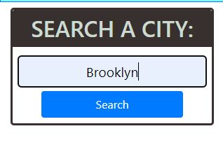
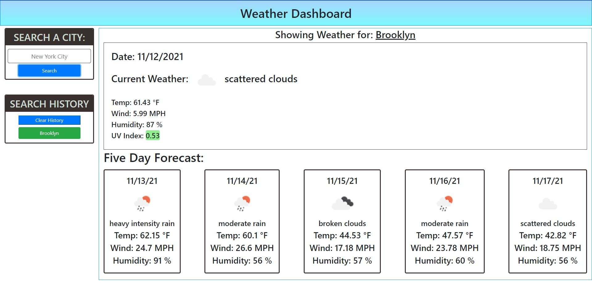
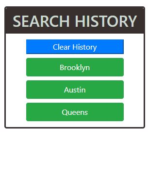

# weather-dashboard
A Dashboard that shows the whether of the city

## Table of Contents 
* [Links](#Links)
* [Usage](#Usage)
* [Credits](#Credits)

## Links

Repo: https://github.com/andrewyu22/weather-dashboard

Link: https://andrewyu22.github.io/weather-dashboard/

## Usage

### Search for a City

### See the Current Weather & 5-day Forecast

### Search History Button (Click the button to pull the data again)

## Credits

Credits to https://openweathermap.org/api 

